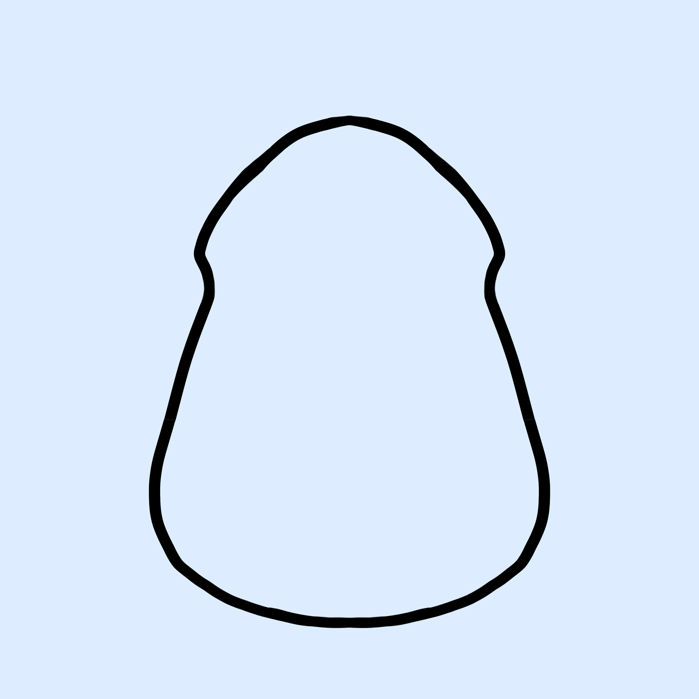
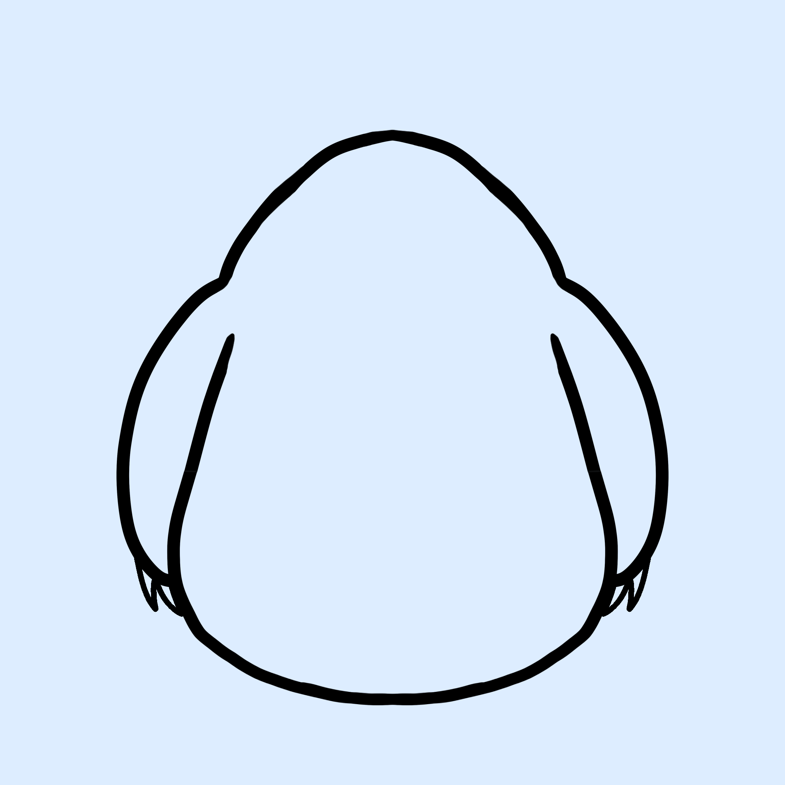
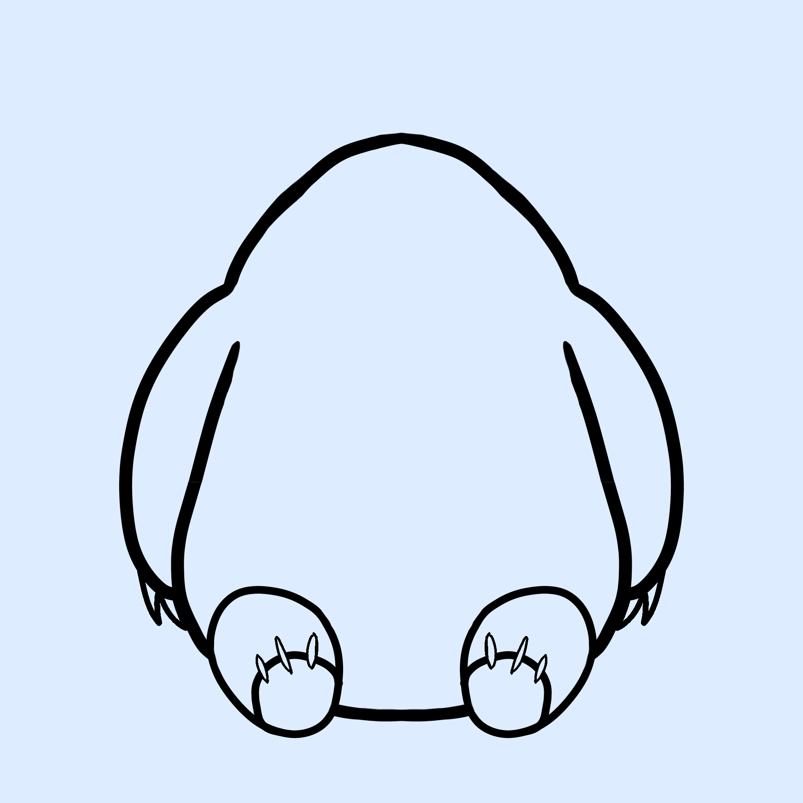
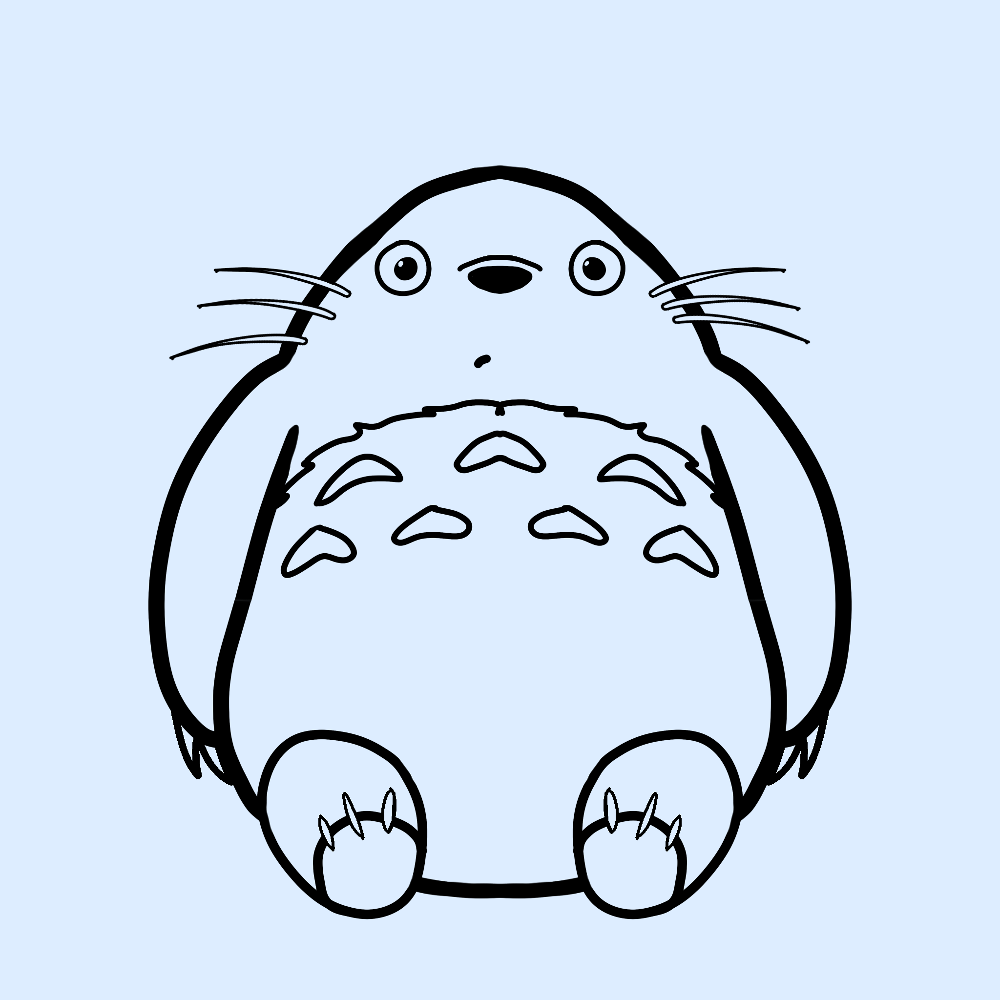
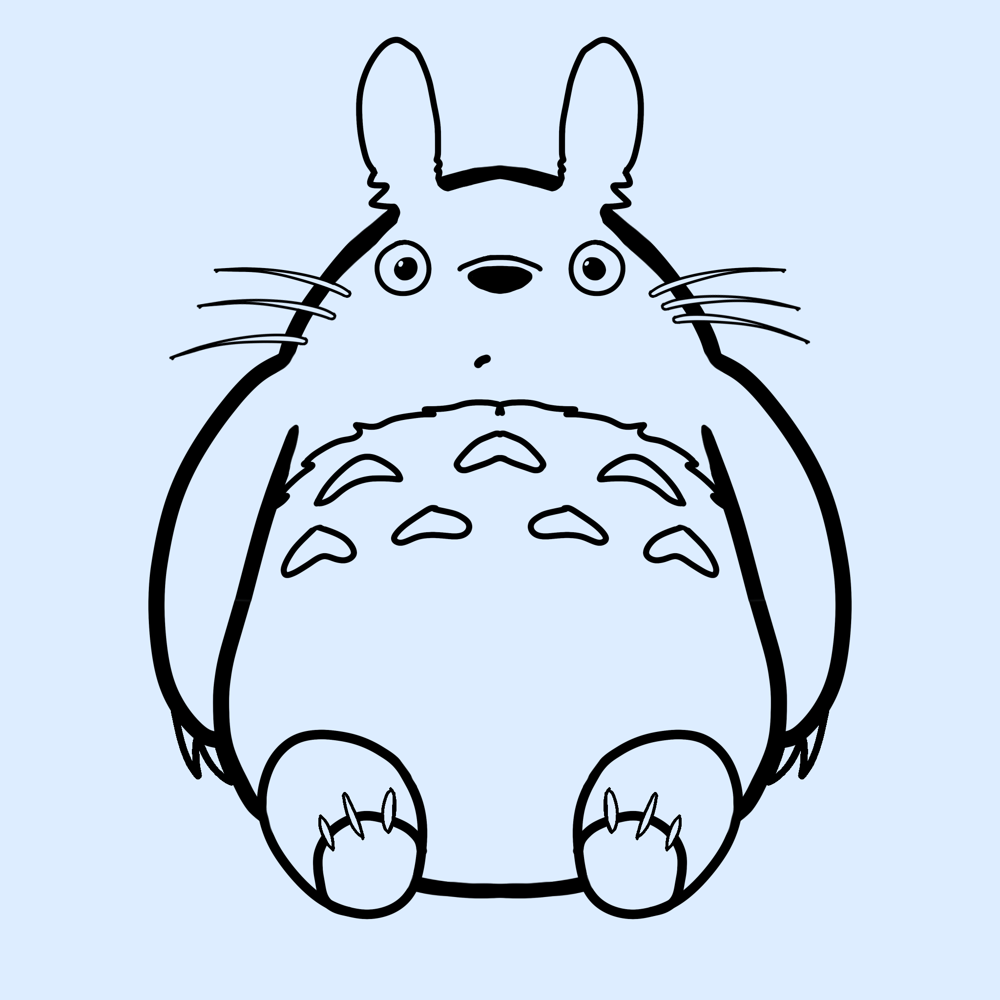
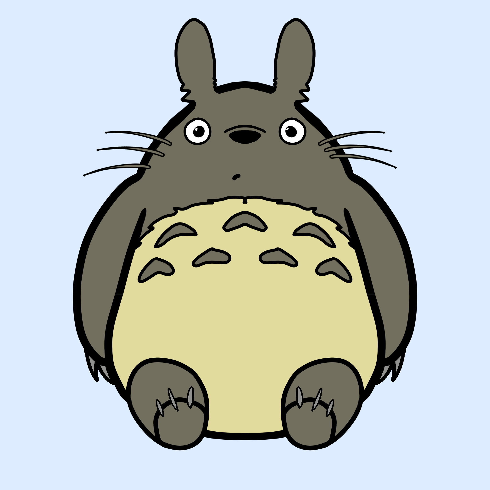
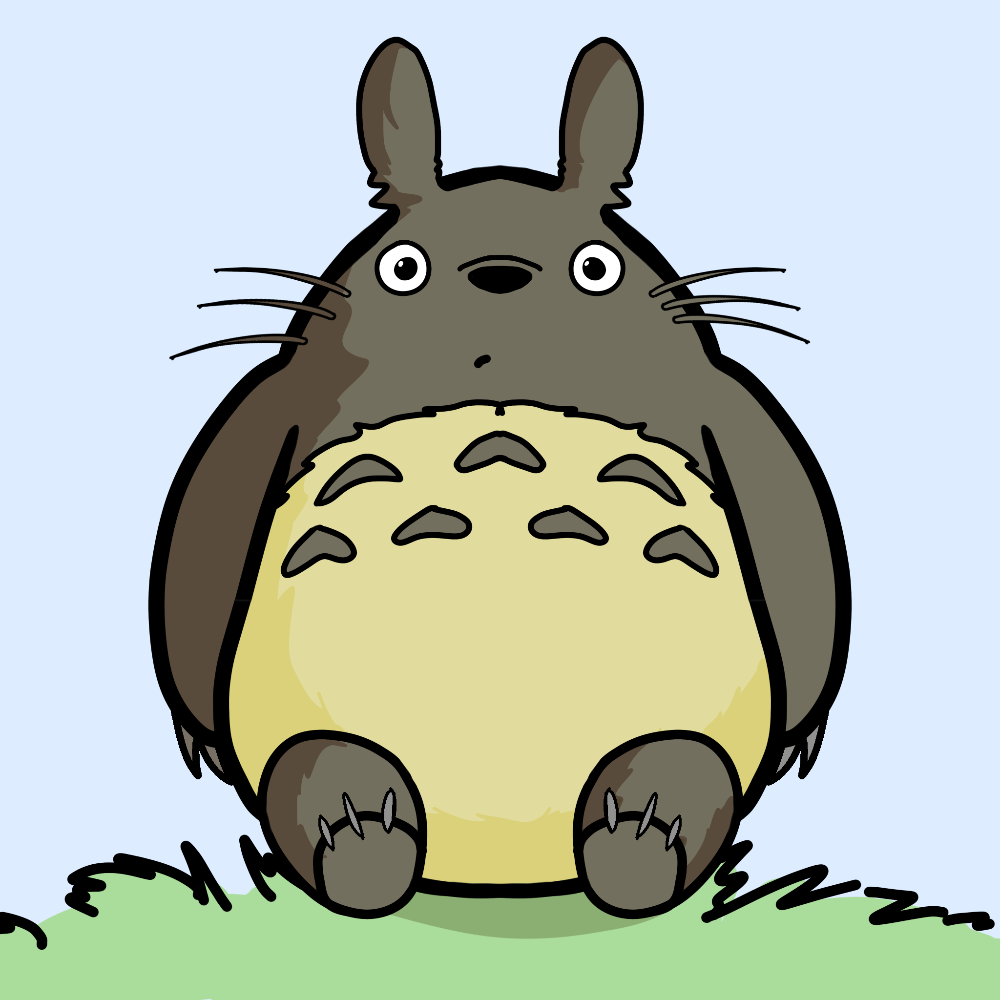

# How to Draw Totoro
---------------------

Totoro is the titular character of the animated film *“My Neighbor Totoro,”* created by Studio Ghibli. The story throughout the movie is heartwarming, mystical, and relatable, and despite it coming out in 1988, it still holds up well because of that story and the amazing animation that comes with it. This tutorial provides a step-by-step guide on drawing Totoro in a simple and understandable manner.

---------------------
### Materials:
- Pencil
- Eraser
- A flat surface
#### Or if you're working digitally,
- Tablet
- Tablet Pen
- Drawing pro gram
     > If your drawing program, it might be easier to turn on any symmetry tools to help make the drawing even.
---------------------

## Step 1

- First you want to draw Totoro's body, and we will use this as a base for the following drawing. You want to make sure to not make the top of his head too narrow, we will need ample space for his face, and leave some room on the top to connect his arms.

 > 
img[alt=step1Totoro] { width: 200px; }

## Step 2

- Next, you want to draw his arms. Totoro's arms reach a bit past halfway down his body, and they are usually at his sides, so you can follow the curve of his belly when adding them. 
- Make sure to add some  small curved triangles on the ends of his paws to make his claws! 

 > 

## Step 3

- Draw two ovals turning outward at the bottom of his body to make his legs! 
- Add a smaller circle at the bottom of his legs to make his feet. And we'll add another smaller circle in that to make his paw pad, and some of the triangles from before to make little claws

 > 

## Step 4

- Let's add some detailing to his stomach with a fuzzy arc separating the bottom of his egg-shaped body. Add seven little boomerangs to make the detail on his fur like so.

 > 

## Step 5

- This is the easiest part. Add two cricles for the eyes, a little triangle nose (with rounded edges), a small arch above it to complete his snout, and finally, some whiskers, a small dot for his mouth, and his face is done!

 > 

## Step 6

- The ears are tricky. You'll want to make two ovals a little above his head, and connect them as though they were antennas, though make the connecting lines a bitt uneven to indicate that it's fur.

 > 

## Step 7

- Add some color! Fell free to look up reference images from the movie to get them just right.

 > 

## Step 8

- Finally, add some little details. Here we added some shading and a bit of grass, but the enviroment he is in is up to you.

 > 

